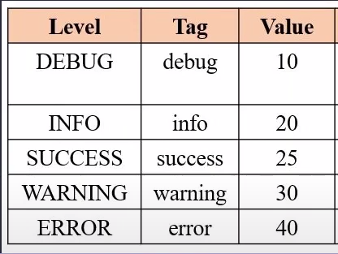
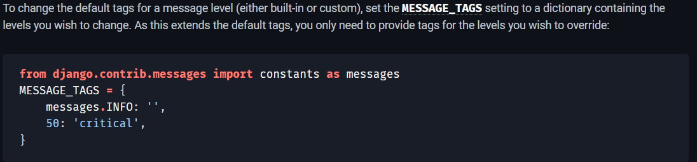

# Django Web Development - Beginner to Advanced

## Creating New Django Project

- `mkdir project_name`
- `python -m venv virtual_environment_name`
- `virtual_environment_name\Scripts\activate` ( to activate virtual_enviroment)
- `django-admin startproject *project_name .*` (usually prefered name is 'config') for easiness later on
- cd `*project_name*`
- `python manage.py startapp *app_name*`
- go to `settings.py` in the main project folder
- add the `*app_name*` to the `*INSTALLED_APPS['app_name']*`

## For Security Purposes store Django Secret Key and PostgreSQL Credentials in the config folder->.env File

- [Start Django Project with a Database(PostgreSQL)](https://stackpython.medium.com/how-to-start-django-project-with-a-database-postgresql-aaa1d74659d8)
- [Creating Environment Variables](https://djangocentral.com/environment-variables-in-django/)
- make `.env` file in the main core folder where `settings.py` resides and shift all secret keys there
- [Follow these instrucitons for best Django Security Practices](https://learndjango.com/tutorials/django-best-practices-security)
- `python -c 'from django.core.management.utils import get_random_secret_key; print(get_random_secret_key())'`. Print this Command into terminal to generate Secret Key. `*This is Django Default method*`.

## Create function Based views

- go to *views.py* of the *app_name* where we need to write business logic.
- then *import djnago.http import HttpResponse* and then make functions
- then go to *settings.py* in the main project forlder
- then write import statement - *from app_name import views*
- find *urlpatterns=[]* in the *settings.py* file
- here we define our url like this - *path('url_name/',views.function_name_from_applicaiton)*
- if we have multiple applications then it will be difficult to manage URLS, so we will make alias for that purpose
- let's say we have *app_name_1* and *app_name_2, so when we import views from both applications then Django will be confused that how this will be handeld.
- so we make alias like this - *from app_name_1 import views as app1_views* & *from app_name_2 import views as app2_views*

### to make project more independent we will make urls in each application, so that we could use them in multiple applications

- we will use *include()* function in main applicaitons urls file in *url_pattern=[]*
- first of all make *urls.py* file in the application folder
- *path('url_name',include('app_name.urls')),*
- use this url to open - localhost:8000/app_name/function_name

### if we are making templates folder inside the main project folder

- go to `*settings.py*` of the main project folder
- add these two lines of code:
- `TEMPLATE_DIR = os.path.join(BASE_DIR , 'templates')`
- the make 2 folders in the main project folder, named `*templates*` & `*static*`.
- but if we make templates folder inside the application folder, then no need to add them in the *settings.py* file
- so if we have to make any HTML file realted to the app's then we make that app folder name inside templates folder, and then place related HTML files inside that, but if we make any HTML file realted to the main project then only place them inside the templates folder.
- then create the views.py file in the main project(config) folder and add its URL's inside the main project(condig) urls.py file. and add this code to import the views.py file - *from . import views*
- another approach is to make another *app* named *core* or *main_site*, then deal this app as main project. then we don;t need to make any views.py file in side the main project folder

### Static Folder

- make a static folder inside the main project folder. then go to `*settings.py*`

```python
- STATIC_DIR = os.path.join(BASE_DIR , 'static')
- STATICFILES_DIRS = [STATIC_DIR]
- static/css/main.css
- static/js/main.js
- static/images/main.jpg
```

- then open HTML file and write this code above. - ``
- `<link href=''>`

### Filters for Django templates

- [Web Reference](https://docs.djangoproject.com/en/4.1/ref/templates/builtins/#built-in-filter-reference)
- *{{ }}* we will add variable in this format
- we will use *|* symbol for using *filters* with *variables* - e.g {{name|upper}} - it will make *NAME*

### Prepare base.html file

- make `base.html` in the `core_app` inside `templates/core/base.html`
- copy the repeated html code
- copy the `<title>` tag
- write this code inside `<title>` tag to make it dynamic across others - `<title> Default Value </title>`
- ``
- then in all other HTML pages we use these code - ``
- `<title> Home Page </title>`
- If we need to import default value as well we use - `<title>{block.super} Home Page </title>`
- `` I am new Home Page. ``

### Prepare URL for href tag

- use `` - `'url_name'` is the name that we give in the urls.py file of the application/project

### use include tag to include other HTML page - we will use this approach to show any dynamically generated results,such as *ML recommedation system*

- let's say we have a *top course page*, so we will use it as follows:
- make top_pages.html page
- then use this code - `` to include that page into any page
- we can pass any custom value as well in it. like this -``
- then that variable name *p* will be shown on *top_pages.html* as django variable`{{ p }}`, to get its value in the main page
- and if i just want to show the 1 value in variable then i wil use like this - ``

## Changing Default Message Template `settings.py`




## Features of Auth/User

- User Registration
- User Login/Logout
- Redirect to User Dashboard
- Authorize User only go to Dashboard
- Update User Profile
- Update User Password with 2 Features - Update with Old Password & Update without Old Password

## User Permissions & Authorization

- To get the logged in user data (username, first_name, last_name, email) - we will user `request.user` to see all data, or more specificaly request.user.first_name to see first name.

- when we create a new Model, it by default gives all permissions. Such as Add, Edit and Delete in the Database.

- If we want to give some permissions to the user such as Add, Edit, Delete or update, then we can use Admin Panel for this. And then in the Template we can check it with the `perms`. Example is below:

```python
{% if perms.enroll.delete_blog % } # Here perms is function,enroll is app name, delete is permission name, and blog is Model name
<input type='button' value = 'delete'>

<p>You have no permission to delete.</p>

```

- so if the user have permission to delete in the Admin pannel, then it will see that delete button, otherwise nothing.

## Dj_Mini_Blog Project

- A Simple Blog with User Account and Group Features like Editor can add/edit blog post and Admin can do all.

## How to Cache / Caching Webpage / Website in the Database - FileSystem

- [Djnago-Cache-Documentation](https://docs.djangoproject.com/en/4.2/topics/cache/)
- add this code in the middelware section to activate caching on all site

```python
MIDDLEWARE = [
    "django.middleware.cache.UpdateCacheMiddleware",
    "django.middleware.common.CommonMiddleware",
    "django.middleware.cache.FetchFromCacheMiddleware",
]
```

- then write this code in `settings.py` to save cache in the databse

```python
CACHES = {
    "default": {
        "BACKEND": "django.core.cache.backends.db.DatabaseCache",
        "LOCATION": "my_cache_table_name",
    }
}
```

- Set the time of cache to expire in seconds

```python
CACHE_MIDDLEWARE_ALIAS  = '' # cache alias
CACHE_MIDDLEWARE_SECONDS = 600 # number of seconds each page should be cached.
CACHE_MIDDLEWARE_KEY_PREFIX = ''  # name of site if multiple sites are used
```

- Now run  the command in terminal `python manage.py createcachetable`. We can change `TIME_ZONE` accordingly for our convenience. If it doesn't work then change `USE_TZ` to `FALSE`.

```python
# For filesystem caching settings are:
CACHES = {
    "default": {
        "BACKEND": "django.core.cache.backends.filebased.FileBasedCache",
        "LOCATION": "/var/tmp/django_cache",
    }
}
# If you’re on Windows, put the drive letter at the beginning of the path, like this:
CACHES = {
    "default": {
        "BACKEND": "django.core.cache.backends.filebased.FileBasedCache",
        "LOCATION": "c:/foo/bar",
    }
}
# Pro Tip: Create a folder namesd 'cache' in the root folder. Right clcik on it and click on 'copy realtive path, and paste in the 'LOCATION'.
```

> Question : How I delete every cache entry in the database after one day, when its expiration time arrives. i want it to automatically delete from the cache_table in the database?

I'm sorry, I misunderstood your question. If you want to delete every cache entry in the database after one day, you can use the **TIMEOUT** option in your CACHES setting. For example:

```python
CACHES = {
    'default': {
        'BACKEND': 'django.core.cache.backends.db.DatabaseCache',
        'LOCATION': 'cache_table',
        'TIMEOUT': 86400 # 1 day in seconds
    }
}
```

```python
This will make the cache entries expire after one day and they will be deleted automatically when they are accessed¹. However, please note that some caches (e.g., the DB cache, filesystem cache, and probably others) do not clean up expired entries except when they're accessed. If you use this trick, you won't ever access the cache entry again and it'll linger until you clear it out⁴.

If you want to delete expired entries periodically without accessing them, you may need to use a custom management command or a cron job to run a SQL query that deletes the expired entries from the cache table³. For example, you can run something like this:
```

```sql
DELETE FROM cache_table WHERE expires < NOW();
```

- [python - Clearing specific cache in Django - Stack Overflow](<https://stackoverflow.com/questions/8784400/clearing-specific-cache-in-django>).
- [How can I expire entries to Django database cache?](<https://stackoverflow.com/questions/51948687/how-can-i-expire-entries-to-django-database-cache>).
- [caching - Django cache get expired entry - Stack Overflow](<https://stackoverflow.com/questions/15535291/django-cache-get-expired-entry>).
- [How to manually clear/update a cached view in django](<https://stackoverflow.com/questions/47040438/how-to-manually-clear-update-a-cached-view-in-django>).

## The per-view cache

> in the `views.py` file we write this, and there is no need to setup any midelwere, but we need to setup the db or filesystem for caching purposes.

```python
from django.views.decorators.cache import cache_page


@cache_page(60 * 15) # 60 Seconds * 15 Minutes. It will be set for 15 Minutes. It will only the current view.
def my_view(request):
    ...
```

> We can also override the `cache prefix` on a per-view basis. `cache_page` takes an optional keyword argument, `key_prefix`, which works in the same way as the `CACHE_MIDDLEWARE_KEY_PREFIX` setting for the middleware. It can be used like this:

```python
@cache_page(60 * 15, key_prefix="site1")
def my_view(request):
    ...
```

> Here’s the same thing, with my_view wrapped in cache_page, but here is the benefit, if we want one link for the cache page, and other without cached content then we will use this method:

```python
from django.views.decorators.cache import cache_page

urlpatterns = [
    path("", cache_page(60 * 15)(my_view),name='my_view'), # it will show the cached page
    path("home/<int:id>/", cache_page(60 * 15)(my_view),name='my_view_cached'), # it will show the cached page
    path("home/", my_view,name='my_view_notcached'), # it will not show the cached page
]
```

## Best way to Caching in Django With Redis Server

[Best Tutorial on Django Caching](https://blog.sentry.io/django-performance-improvements-part-4-caching-in-django-applications/)
> We are going to create an application that displays product records, and then we will query to see the different ways of using a cache to retrieve data faster using a cache.

```python
pip install django-redis
```

```python
CACHES = {
    "default": {
        "BACKEND": "django_redis.cache.RedisCache",
        "LOCATION": "redis://127.0.0.1:6379/1",
        "OPTIONS": {
            "CLIENT_CLASS": "django_redis.client.DefaultClient"
        },
        "KEY_PREFIX": "example"
    }
}
```
